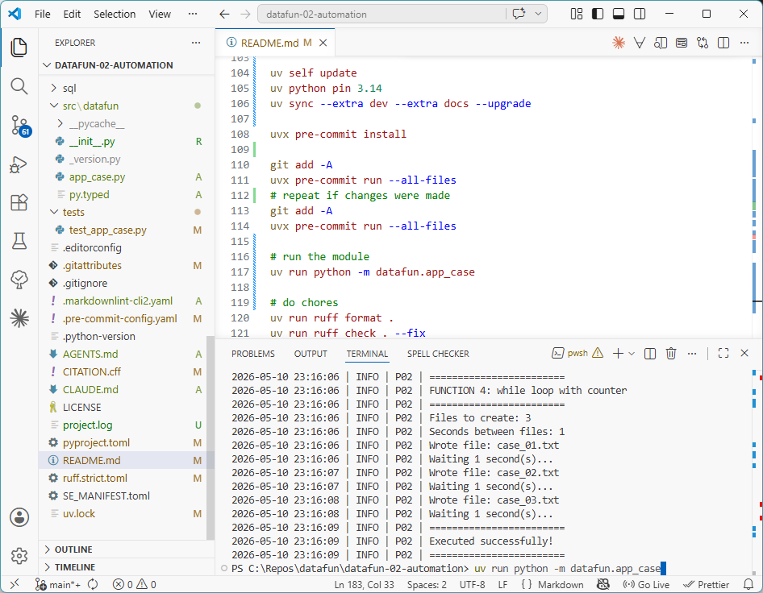

# datafun-02-automation

[](https://denisecase.github.io/pro-analytics-02/workflow-b-apply-example-project/)
[](./pyproject.toml)
[](./LICENSE)

> Professional Python project: automation with loops, branches, and functions.

Data analytics requires a variety of skills.
This course builds capabilities through working projects.

In the age of generative AI, durable skills are grounded in real work:
setting up a professional environment,
reading and running code,
understanding the logic,
and pushing work to a shared repository.
Each project follows the structure of professional Python projects.
We learn by doing.

## This Project

This project introduces **automation**, using code to repeat a set of logic without doing it manually.

Think of logic you might want to repeat:

- logic for each number in a sequence
- logic for each item in a list
- converting a list into another list
- logic that repeats while a condition is true

You will run the example module, read the code,
and apply the same patterns to automate your own logic.

## Working Files

You'll work with just these areas:

- **docs/** - the project narrative and documentation
- **src/datafun** - where the magic happens
- **pyproject.toml** - update authorship & links
- **zensical.toml** - update authorship & links

## Instructions

Follow the
[step-by-step workflow guide](https://denisecase.github.io/pro-analytics-02/workflow-b-apply-example-project/)
to complete:

1. Phase 1. **Start & Run**
2. Phase 2. **Change Authorship**
3. Phase 3. **Read & Understand**
4. Phase 4. **Modify**
5. Phase 5. **Apply**

## Challenges

Challenges are expected.
Sometimes instructions may not quite match your operating system.
When issues occur, share screenshots, error messages, and details about what you tried.
Working through issues is part of implementing professional projects.

## Success

After completing Phase 1. **Start & Run**, you'll have your own GitHub project,
running on your machine, and running the example will print out:

```shell
========================
Executed successfully!
========================
```

A new file `project.log` will appear in the root project folder.

## Command Reference

The commands below are used in the workflow guide above.
They are provided here for convenience.

Follow the guide for the **full instructions**.

<details>
<summary>Show command reference</summary>

### In a machine terminal (open in your `Repos` folder)

After you get a copy of this repo in your own GitHub account,
open a machine terminal in your `Repos` folder:

```shell
# Replace username with YOUR GitHub username.
git clone https://github.com/sum-randow/data-fun-02-automation

cd data-fun-02-automation
code .
```

### In a VS Code terminal

```shell
# reset uv cache only after suspected cache corruption or strange dependency errors
# uv cache clean

uv self update
uv python pin 3.14
uv sync --extra dev --extra docs --upgrade

uvx pre-commit install

git add -A
uvx pre-commit run --all-files
# repeat if changes were made
git add -A
uvx pre-commit run --all-files

# run the module
uv run python -m datafun.app_sum-randow

# do chores
uv run ruff format .
uv run ruff check . --fix
uv run python -m pyright
uv run python -m pytest
uv run python -m zensical build

# save progress
git add -A
git commit -m "update"
git push -u origin main
```

</details>

## Notes

- Use the **UP ARROW** and **DOWN ARROW** in the terminal to scroll through past commands.
- Use `CTRL+f` to find (and replace) text within a file.
- You do not need to add to or modify `tests/`. They are provided for example only.
- Many files are silent helpers. Explore as you like, but nothing is required.
- You do NOT not to understand everything; understanding builds naturally over time.

## Troubleshooting >>>

If you see something like this in your terminal: `>>>` or `...`
You accidentally started Python interactive mode.
It happens.
Press `Ctrl+c` (both keys together) or `Ctrl+Z` then `Enter` on Windows.

## Example Output

```shell
| P02 | === RUN START ===
| P02 | project=P02
| P02 | repo_dir=data-fun-02-automation
| P02 | python=3.14.5
| P02 | os=Darwin 24.6.0
| P02 | shell=zsh
| P02 | cwd=.
| P02 | github_actions=False
| P02 | ========================
| P02 | START main()
| P02 | ========================
| P02 | ========================
| P02 | FUNCTION 2: for loop over a list
| P02 | ========================
| P02 | New Teacher List: ['Grading', 'Parent_Contact_Log', 'PLC', 'Extra_Duties']
| P02 | Wrote file: a_Grading.txt
| P02 | Wrote file: a_Parent_Contact_Log.txt
| P02 | Wrote file: a_PLC.txt
| P02 | Wrote file: a_Extra_Duties.txt
| P02 | ========================
| P02 | FUNCTION 3: list comprehension
| P02 | ========================
| P02 | Original list: ['Grading', 'Parent_Contact_Log', 'PLC', 'Extra_Duties']
| P02 | Transformed list: ['HS_Grading', 'HS_Parent_Contact_Log', 'HS_PLC', 'HS_Extra_Duties']
| P02 | Wrote file: HS_Grading.txt
| P02 | Wrote file: HS_Parent_Contact_Log.txt
| P02 | Wrote file: HS_PLC.txt
| P02 | Wrote file: HS_Extra_Duties.txt
| P02 | ========================
| P02 | Executed successfully!
P02 | ========================
```


